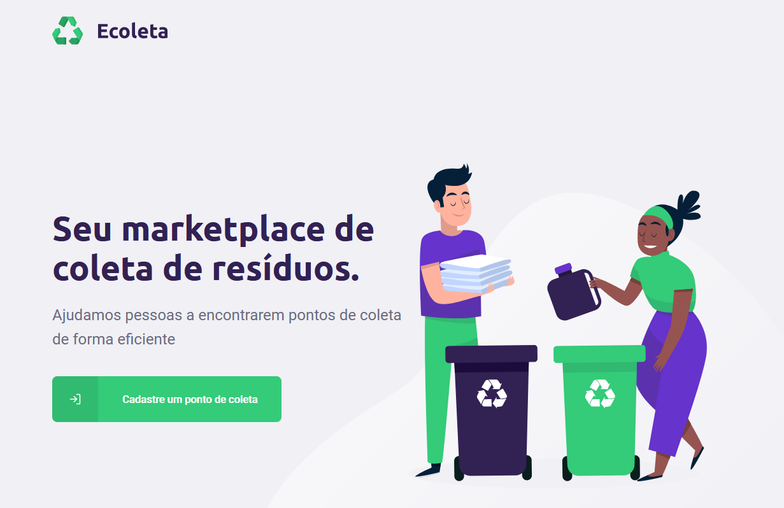

<h1 align="center">
 
  
 
 
ECOLETA
</h1>

Connecting people to Recycling Companies!

  
  

## About Ecoleta
This app has two major systems combining into a powerful idea that can help people to be more active on the environmental cause.
   
It allows recycling companies to publish their addres and inform what kind of items they are able to recycle and collect.  Users, on the other hand, can use the app to look right on the map API for the nearest recycling point. Users can also filter what categories of items they are looking forward to discard. 
By choosing one recycling point, Users have access to selected Company's profile, featuring Photo, Name, address, MailTo Button and Whatsapp Contact Button.

## Features
This app uses the best features to web and app development:

- ⚛️ **React Js** — Used for the Company's Sign Up Form website
- ⚛️ **React Native** — Used for the Users app
- 💹 **Node Js** — Used for Backend features like App Filters, database manager, Company's profile page and so on
- 💹 **Node Js Dependencies** - Axios, Knex, Express, Crypto, Multer, Cors and others

## Getting started
<b>* Yarn required</b> 
1. Clone this repo using <code>git clone git@github.com:sor-alan/NLW-01.git</code>

### Server Config
1. Set server IP on PointsController.ts and itemsController.ts files 
2. Open terminal on src folder  
3. Run <code>npm install</code> to install node dependencies  
4. Build database by running <code>npx knex migrate:latest --knexfile knexfile.ts</code> 
5. Run server with <code>yarn dev</code>

### Web App Config
1. Set server and web IP on Api.ts, index.ts (CreatePoint and Home) files 
2. Open terminal on web folder  
3. Run server with <code>npm start</code>

### App Config
1. Download Expo App from PlayStores/AppStore  
2. Open terminal on mobile folder  
3. Run server with <code>npm start</code> 
4. Connect your phone through Expo  

<h1 align="center">
Thank you!
</h1>

  

