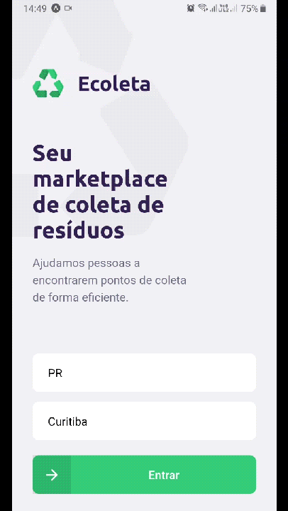
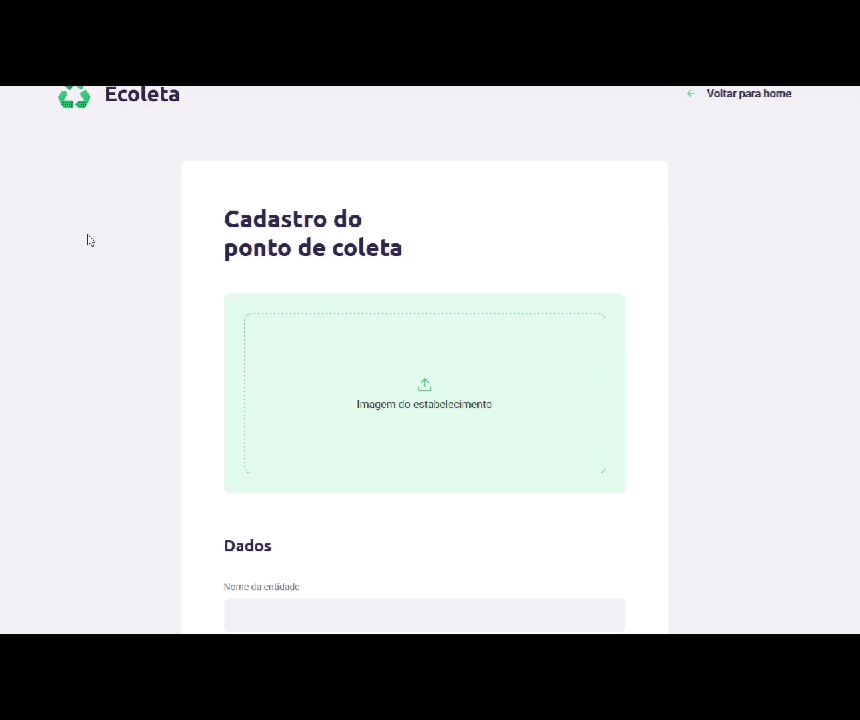

<h1 align="center">
 
  
 
 
ECOLETA
</h1>

Connecting people to Recycling Companies!

  
  

## Features
This app has two major systems combining into a powerful idea that can help people to be more active on the environmental cause.
   
It allows recycling companies to sign up through a website in a marketplace to make people know what they collect as waste for recycling. Users, on the other hand, can use the app to look right on the map API where they can discard their wastes and garbages properly. Users can also filter what categories of items the Recycling companies collect in order to get right into what they are looking for.

This app uses the best features to web and app development:

- ⚛️ **React Js** — Used for the Company's Sign Up Form website
- ⚛️ **React Native** — Used for the Users app
- 💹 **Node Js** — Used for Backend features like App Filters, database manager, Company's profile page and so on
- 💹 **Node Js Dependencies** - Axios, Knex, Express, Crypto, Multer, Cors and others

## Getting started
<b>* Yarn required</b> 
1. Clone this repo using <code>git clone git@github.com:sor-alan/NLW-01.git</code>

### Server Config
1. Open terminal on src folder  
2. Run <code>npm install</code> to install node dependencies  
3. Build database by running <code>npx knex migrate:latest --knexfile knexfile.ts</code>
